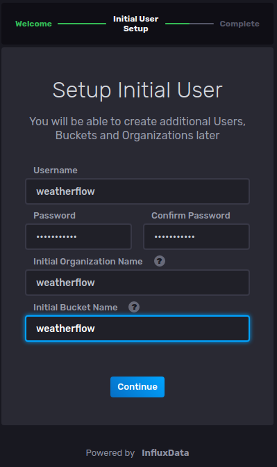
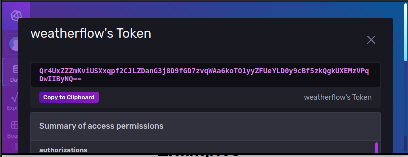
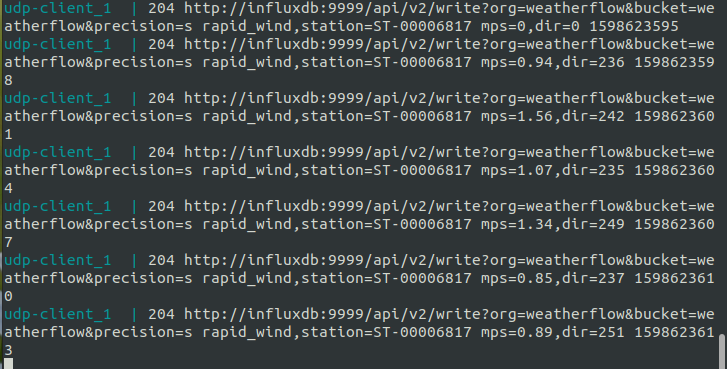
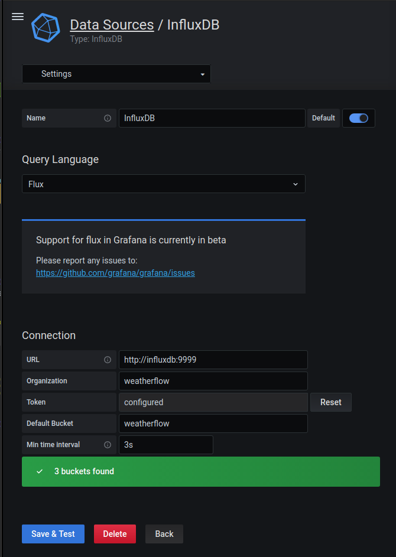

# weatherflow-node

Stores data from Weatherflow hub UDP broadcast into InfluxDB, and uses Grafana and some custom widgets to display a dashboard of data relevant to wind sport operations such as skydiving.

## Requirements

- [Weatherflow Tempest](https://weatherflow.com/tempest-weather-system/) weather station
- Linux - _Ubuntu 20.04 and Raspberry Pi OS 64-bit known to work_
- Rasberry PI - _(optional, Model 4B 8G RAM preferable)_
- [Docker](https://www.docker.com/)
- [docker-compose](https://docs.docker.com/compose/)

## Installation for Raspberry PI

Download and copy [64-bit Raspberry PI OS](http://downloads.raspberrypi.org/raspios_arm64/images/raspios_arm64-2020-08-24/2020-08-20-raspios-buster-arm64.zip) onto an SD card using the [Raspberry PI Imager](https://www.raspberrypi.org/downloads/). Insert the SD card into your Rasberry PI and turn it on. Once the OS boots, follow the prompts to set it up. Once setup is done, you'll be prompted to reboot the PI.

### Install Docker

In a Terminal window, run the following commands:

```
# Download and install Docker for your platform/architecture
curl -fsSL https://get.docker.com -o get-docker.sh

sudo sh get-docker.sh

# Add user to docker group so user can run docker without sudo
sudo usermod -aG docker pi

docker run hello-world
```

If the last command fails with 'permission denied', log out and log back in, or reboot, and try it again.

### Install docker-compose

```
# Install required packages
sudo apt update
sudo apt install -y python3-pip libffi-dev

# Install Docker Compose from pip (using Python3)
# This might take a while
sudo pip3 install docker-compose
```

### Install weatherflow-node (this project)

```
git clone https://github.com/doppler/weatherflow-node.git

cd weatherflow-node

docker-compose pull

# find the IP address of your Raspberry PI. You'll use it to connect to InfluxDB, Grafana, and the dashboard app later.
ip a
```

### Set up InfluxDB

```
# Start InfluxDB so you can set it up:
docker-compose up influxdb
```

Navigate to `http://your-raspberry-pi-ip-address:9000`, e.g. http://192.168.1.109:9000

Click "Get Started", then fill out all the required fields.

Use **weatherflow** for all fields. The services are only running on your local network, and in containers at that, so security is not a big issue.



From the **InfluxDB** home page, navigate to **Data > Tokens > weatherflow's Token**, then click **Copy to Clipboard**.



### Set up udp-client

Create a file, `/home/pi/weatherflow-node/udp-client/.env` with the following content, replacing the value of `INFLUXDB_TOKEN` with the value you copied in the previous step.

```
INFLUXDB_HOST = "http://influxdb:9999"
INFLUXDB_ORG = "weatherflow"
INFLUXDB_BUCKET = "weatherflow"
INFLUXDB_TOKEN='Qr4UxZZZmKviUSXxqpf2CJLZDanG3j8D9fGD7zvqWAa6koTO1yyZFUeYLD0y9cBf5zkQgkUXEMzVPqDwIIByNQ=='
```

Build and start the `udp-client` service:

```
docker-compose build udp-client

docker-compose up udp-client
```

You should now see log entries of `udp-client` inserting data into `influxdb`.



Shut down the service by pressing `CTRL C`, then restart it in the background by typing `docker-compose up -d udp-client`.

### Set up Grafana

```
docker-compose up -d grafana
```

Navigate to `http://your-raspberry-pi-ip-address:3000`, e.g. http://192.168.1.109:3000

Click the Sign In icon, located near the lower-left of the page. The default username/password is `admin/admin`. You'll be prompted to change the password. Again, security shouldn't be a big issue here, so I just used `weatherflow` as the password.

You'll need to add your InfluxDB instance as a Data Source. From the left-hand menu item that looks like a cog (Configuration), choose `Data Sources`. Choose `InfluxDB`. On the subsequent screen, enter the following, substituting the token copied from `weatherflow's Bucket` earlier. Make sure you choose `Flux` in the `Query Language` select box.



Click `Save & Test`.

Now you can import the preconfigured dasboard widgets. On the left-hand navigation, hover over the icon that looks like four squares (Dashboards) and choose `Manage`. Click the `Import` button on the right. Click `Upload JSON file` and choose the file `grafana-dashboard.json` from this project, then click `Import`.

### Set up dashboard

Copy the dashboard configuration file.

```
cp dashboard/config.example.js dashboard/config.js
```

Edit the content of `dashboard/config.js` to reflect your location. The `region` and `station` values are used to fetch data from https://winds-aloft-json.herokuapp.com/. Visit that page to find the station nearest you. For example, central Texas would be https://winds-aloft-json.herokuapp.com/forecast/dfw/SAT, so the `region` is `dfw` and `station` is `SAT`.

Now you can build the dashboard service:

```
docker-compose build dashboard
```

### Finally!!!

Shut the services down, and bring them all back up

```
docker-compose down

docker-compose up -d
```

Navigate to `http://ip-address-of-your-rasberry-pi:5000` and you should see your dashboard in all it's not-ready-for-primetime glory!

### One more thing:

In order to have the services and dashboard page auto-start at boot time, run the following:

```
sudo apt install netcat

sh ./autostart/install.sh
```
